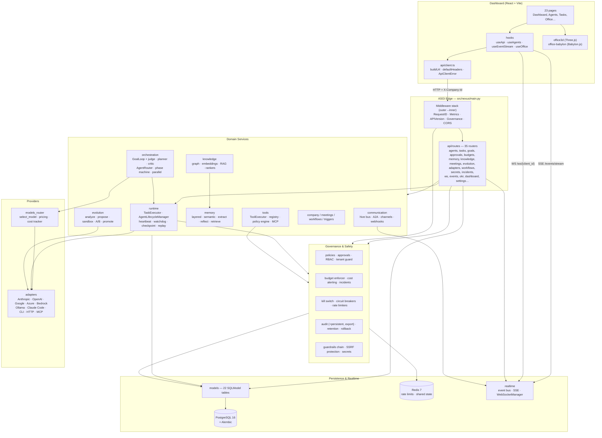

# NEXUS Architecture

> Generated from the GitNexus knowledge graph (index: commit `12406e3`, 583 files, 14,581 symbols, 24,263 edges, 446 clusters, 226 execution flows).

## Overview

NEXUS is an "Autonomous AI Company Operating System": a FastAPI backend that models a company of AI agents (departments, teams, goals, tasks, meetings, budgets) plus a React dashboard that visualizes and controls it, including a 3D office view.

The system is organized in four bands:

1. **Edge** — ASGI middleware stack (request ID, metrics, API version, governance) and ~35 route modules.
2. **Domain services** — agent lifecycle, task execution, orchestration, tools, memory, knowledge, communication, meetings, evolution.
3. **Governance & safety** — policy evaluation, approvals, budgets, kill switches, circuit breakers, rate limits, audit, RBAC, tenancy.
4. **Providers & persistence** — LLM/CLI/MCP adapters, model router with cost tracking, SQLModel/PostgreSQL, Redis.

| Aspect | Detail |
| --- | --- |
| Backend | Python ≥3.12, FastAPI, SQLModel + SQLAlchemy (async), Alembic, asyncpg, Redis, uvicorn |
| Frontend | React + TypeScript, Vite, React Router, Three.js and Babylon.js office scenes |
| Datastores | PostgreSQL 16 (primary), Redis 7 (rate limits / shared state); SQLite supported for local dev |
| Realtime | Server-Sent Events (`/events/stream`) and WebSockets (`/ws/{client_id}`) |
| Entry point | `src/nexus/main.py` (`app`, with `lifespan` startup/shutdown) |
| Tests | 112 pytest modules under `tests/`, Playwright e2e under `e2e/` |
| Deploy | `Dockerfile` + `docker-compose.yml` (postgres, redis, nexus-server) |

## Functional Areas

Cluster sizes below come from the graph's community detection (Leiden); file counts come from the on-disk layout under `src/nexus/`.

### Backend (`src/nexus/`)

| Area | Files | Cohesion | Responsibility |
| --- | --- | --- | --- |
| `governance/` | 39 | 88% | Approvals, policies, audit (in-memory + persistent + export), budget enforcement and incidents, kill switches, circuit breakers (advanced + persistent), rate limiting (local and Redis), RBAC, tenant guard, SSRF protection, retention, rollback, secret backends, control registry |
| `api/` | 33 | 72% | `deps.py` (tenant/session dependencies), `middleware.py` (governance ASGI middleware), `versioning.py`, and `routes/` (35 routers) |
| `models/` | 19 | — | SQLModel tables: agent, task, company, budget, communication, evolution, governance, heartbeat_run, incident, knowledge, meeting, memory, notification, pipeline, policy, repository, secret, settings, skill, tool, tool_invocation, trigger |
| `adapters/` | 17 | 96% | Agent/LLM execution backends: Anthropic, OpenAI, Azure, Bedrock, Google, Ollama, Claude Code, generic CLI and HTTP, MCP; plus `registry.py`, `retry.py`, `llm_circuit_breaker.py`, `provider_presets.py` |
| `templates/` | 16 | — | Prompt and company templates |
| `evolution/` | 15 | 99% | Self-improvement pipeline: analyzer, proposer (heuristic + LLM), evaluator, A/B testing, statistical significance, sandbox / isolated sandbox, promoter, observer, agent and skill evolution, failure alchemy |
| `memory/` | 14 | 86% | Layered memory store, semantic store, extraction (heuristic + LLM), dedup, compaction, promotion, reflection, retrieval, scoping, token counting |
| `communication/` | 14 | 91% | Hive message bus (protocol, router, manager, backend, task), A2A protocol + router, channels, event bus, webhook server/queue/types |
| `runtime/` | 12 | 98% | `TaskExecutor`, `AgentLifecycleManager`, heartbeat + heartbeat service, watchdog, checkpoint, replay, cycle guard, closing time, worktree, adapter bridge |
| `orchestration/` | 12 | 97% | `GoalLoop` with independent judge, planner (+ LLM planner), critic (+ LLM critic), agent router, phase machine, parallel execution, reasoning, retry / smart retry |
| `knowledge/` | 10 | 81% | Knowledge graph + types, embeddings, RAG, retrievers, rankers, parsers, experience store, plaza |
| `models_router/` | 10 | — | Model selection per task type, provider registry, pricing tables, cost tracker |
| `tools/` | 10 | — | `ToolExecutor` (permissions, rate limits, timeout, audit), registry, tool catalog, skills catalog/discovery, policy engine, MCP client + stdio transport, audit |
| `triggers/` | 9 | 100% | Scheduler, webhook and context triggers, classifier, schema validator, executor, history |
| `services/` | 6 | — | Thin service layer over models: agent, task, approval, budget, skill |
| `company/` | 6 | — | Org chart, hiring, delegation, OKRs, performance |
| `realtime/` | 6 | 86% | Event bus, event types, channels, SSE formatting, WebSocket manager |
| `evaluation/` | 5 | — | Benchmarks, evaluator, metrics, reporter |
| `plugins/` | 5 | — | Plugin registry, loader, protocol, hook system |
| `guardrails/` | 5 | — | Guardrail chain, policy, protocol, structural checks |
| `meetings/` | 4 | — | Conductor (agenda + minutes), scheduler, templates |
| `workflows/` | 4 | 76% | Company flow, task flow, pipeline |
| `demo/` | 4 | — | Seed data and demo setup |
| `identity/` | 3 | — | Persona and "soul" definitions |
| Root modules | 6 | — | `main.py`, `config.py`, `config_validator.py`, `database.py`, `logging_config.py`, `telemetry.py` |

### Frontend (`dashboard/src/`)

| Area | Contents |
| --- | --- |
| `pages/` (23) | Dashboard, Agents, AgentDetailPage/Tabs, Tasks, Pipelines, Organization, Goals, Skills, Tools, Memory, GitRepos, KnowledgeBase, Approvals, Budgets, Evolution, Workflows, Meetings, Activity, Notifications, Settings, HRRoom, Office |
| `api/` (9) | `client.ts` (fetch wrapper, `ApiClientError`, `buildUrl`, `defaultHeaders`), plus agents, tasks, budgets, companies, activity, events, evolution, workflows |
| `hooks/` (7) | `useApi`, `useAgents`, `useEventStream`, `useOffice`, `usePolling`, `usePageVisibility`, `useMediaQuery` |
| `components/` | layout, common, charts, agents, tasks, activity, org, governance, evolution, office, `office3d/` (Three.js), `office-babylon/` (Babylon.js) |

## Module Dependency Map

Top inter-area import edges from the graph (`IMPORTS`, cross-directory only):

| From | To | Edges |
| --- | --- | --- |
| `main.py` | `api` | 30 |
| `api` | `models` | 23 |
| `adapters` | `runtime` | 12 |
| `knowledge` | `memory` | 7 |
| `api` | `governance` | 5 |
| `runtime` | `models` | 5 |
| `services` | `models` | 5 |
| `api` | `realtime` | 4 |
| `communication` | `models` | 4 |

Intra-area coupling dominates (`governance`→`governance` 39, `adapters`→`adapters` 34, `evolution`→`evolution` 20), which matches the high per-cluster cohesion — areas are largely self-contained and meet at `models`, `api`, and `runtime`.

## Architecture Diagram



## Key Execution Flows

### 1. HTTP request lifecycle (`GovernanceMiddleware.__call__`, `src/nexus/api/middleware.py:91`)

Pure ASGI middleware (deliberately not `BaseHTTPMiddleware`, to avoid streaming deadlocks). Order of checks:

1. Non-HTTP scopes pass straight through.
2. Parse `X-Company-Id` into a UUID (silently ignored if malformed).
3. **Kill switch** — active for the company ⇒ `503 KILL_SWITCH_ACTIVE`.
4. **Tenant isolation** — stash `company_id` in the ASGI scope state for downstream dependencies.
5. **Rate limit** — compute remaining quota for the tenant.
6. **Policy evaluation** — denial ⇒ `403 POLICY_DENIED`.
7. **Budget pre-check** on mutating methods — estimated cost over budget ⇒ `429 BUDGET_EXCEEDED`.
8. Wrap `send` to inject `x-ratelimit-*` and `x-request-cost-ms` headers, and emit an audit log line for mutating requests.

Middleware registration order in `main.py` makes `RequestIDMiddleware` outermost, then metrics, API version, governance, CORS.

### 2. Task execution (`TaskExecutor.execute`, `src/nexus/runtime/executor.py:184`)

```
check budget → validate permissions → status=running
  → adapter.execute_task (retry loop, max_retries)
      success → record cost → status=completed → return TaskResult
      failure → retry; on exhaustion → status=failed → raise TaskExecutionError
```

`BudgetExceededError` short-circuits the retry loop rather than being retried; cost is recorded per successful attempt against the task's company.

### 3. Agent lifecycle (`AgentLifecycleManager`, `src/nexus/runtime/lifecycle.py:38`)

A state machine with an explicit transition table (`_validate_transition`) over `create_agent → configure_agent → wake_agent → execute_agent_task → monitor_agent → suspend_agent → terminate_agent`. `wake_agent` returns an `AgentSession` that `execute_agent_task` (line 159) then uses; invalid transitions raise `LifecycleError`. `HeartbeatService` (`runtime/heartbeat_service.py`) tracks run liveness, outputs, continuations, and `detect_stale` for the watchdog.

### 4. Goal-gated autonomous loop (`GoalLoop.run`, `src/nexus/orchestration/goal_loop.py:207`)

Iterates `execute_fn` and has an independent judge (`GoalJudge` protocol; `HeuristicGoalJudge` default, LLM judge available) evaluate each output. Four safety valves, each returning a `GoalResult` with a distinct `stopped_reason`:

| Stop reason | Trigger |
| --- | --- |
| `judge_confirmed` | judge returns `is_complete` (success) |
| `budget_exceeded` | cumulative `cost_cents` over the limit |
| `execution_error` | `execute_fn` raised |
| consecutive parse failures | judge raised `max_consecutive_parse_failures` times in a row |

Plus the `max_iterations` bound on the loop itself.

### 5. Tool invocation (`ToolExecutor.execute`, `src/nexus/tools/executor.py:133`)

```
permission check  → denied       → ToolResult(success=False) + audit "denied"
rate limit check  → exceeded     → ToolResult(success=False) + audit "rate_limited"
asyncio.wait_for(execute_fn, timeout) → success/timeout/error
  → record invocation (ToolInvocation) + audit entry
```

Every path records an invocation, and arguments are scrubbed first (`_scrub_arguments` redacts keys containing `password`, `secret`, `token`, `key`) so secrets never reach audit storage.

### 6. Realtime fan-out

- **SSE** — `GET /events/stream` (`api/routes/events.py`) authenticates via `CurrentCompanyId`, subscribes a bounded `asyncio.Queue` (maxsize 256) to the `RealtimeEventBus`, filters by tenant (`company_id is None` = broadcast) and optional `event_types`/`channel`, emits `: keepalive` every 30s, and unsubscribes on disconnect.
- **WebSocket** — `/ws/{client_id}` (`api/routes/ws.py`) authenticates before `accept()`, closing with `WS_1008_POLICY_VIOLATION` on failure, then registers with `WebSocketManager` for channel subscribe/unsubscribe messages.
- **Frontend** — `hooks/useEventStream.ts` wraps `SSEStreamClient` from `api/events.ts`.

### 7. Dashboard request path (the graph's most-traversed frontend flows)

`AgentDetailPage → handleWake → agents.wake → apiClient.post → handleResponse → ApiClientError` — every page funnels through `api/client.ts`, so `buildUrl`, `defaultHeaders` (which carries the tenant header) and `handleResponse` are the highest-fan-in frontend symbols. `Agents`, `Budgets`, `Organization`, `useOffice`, `useAgents`, and the `handlePause` / `handleDelete` / `handleSave` handlers all trace the same 5–6 step shape.

## Startup and Shutdown (`lifespan`, `src/nexus/main.py:56`)

**Startup:** create tables when `database_url` is SQLite → upsert the default company (`00000000-0000-4000-8000-000000000001`, "NVLabs") → seed demo data via `demo.seed.seed_database` → reload governance state from the DB (`PersistentKillSwitch.load_active`, `PersistentCircuitBreaker.load_state`, warn-only on failure) → initialize the Plugin SDK (`HookManager` + empty `PluginRegistry` on `app.state`) → run non-blocking `validate_config()`.

**Shutdown:** persist `ControlRegistry` state via the runtime singleton (`api/routes/control.get_registry`). Telemetry metrics are intentionally *not* reset — Prometheus scrapes externally, so clearing would drop unscraped data.

## Operator Control Plane

`api/routes/control.py` exposes per-agent operator overrides backed by a module-level `ControlRegistry` singleton: `pause`, `gate-tool`, `steer` (inject a guidance note), `halt`, `resume`, and `snapshot` (paused / halted / auto-delivery-paused / gated tools / pending steers). `GET /system/degradation` (`routes/degradation.py`) reports full/degraded/unavailable status for Redis, Docker, LLM keys, embeddings, and layered memory; `routes/health.py` provides `/health/live`, `/health/ready` (DB probe), and `/health`.

## Data Layer

22 SQLModel modules under `src/nexus/models/` back the domain areas one-to-one (agent, task, company, budget, communication, evolution, governance, heartbeat_run, incident, knowledge, meeting, memory, notification, pipeline, policy, repository, secret, settings, skill, tool, tool_invocation, trigger). Migrations live in `alembic/versions/`: initial schema, kill switch records, circuit breaker records, and notifications/pipelines/repositories.

## Structural Notes

- **Two import cycles** currently exist (`gitnexus check`):
  - `dashboard/src/components/office-babylon/BabylonCanvas.tsx ↔ OfficeScene.ts`
  - `src/nexus/memory/dedup.py ↔ src/nexus/memory/layered.py`
- **Two 3D implementations coexist** — `components/office3d/` (Three.js) and `components/office-babylon/` (Babylon.js); the Office page is lazy-loaded behind `Suspense`.
- **In-memory singletons** back several subsystems (`ControlRegistry`, `HeartbeatService`, `_KillSwitchRegistry`, the SSE `RealtimeEventBus`, `ToolExecutor` audit log). They are single-process by design; multi-worker deployments need the Redis-backed variants (`governance/redis_state.py`, `redis_rate_limiter.py`) or DB persistence (`persistent_kill_switch.py`, `persistent_circuit_breaker.py`).
- **Lowest-cohesion clusters** are `Secrets` (66%), `Api` (72%), and `Hooks` (75%) — the likeliest refactor candidates; `Adapters` (96%), `Runtime` (98%), `Orchestration` (97%), `Evolution` (99%), `Triggers` and `Office3d` (100%) are tightly scoped.

## Regenerating This Document

```bash
gitnexus analyze .          # re-index (~34s for this repo)
gitnexus status             # confirm indexed commit matches HEAD
gitnexus check              # structural checks (import cycles)
gitnexus query "<concept>"  # execution flows for an area
gitnexus context <symbol>   # callers, callees, process participation
gitnexus impact <symbol> --direction upstream   # blast radius
```
