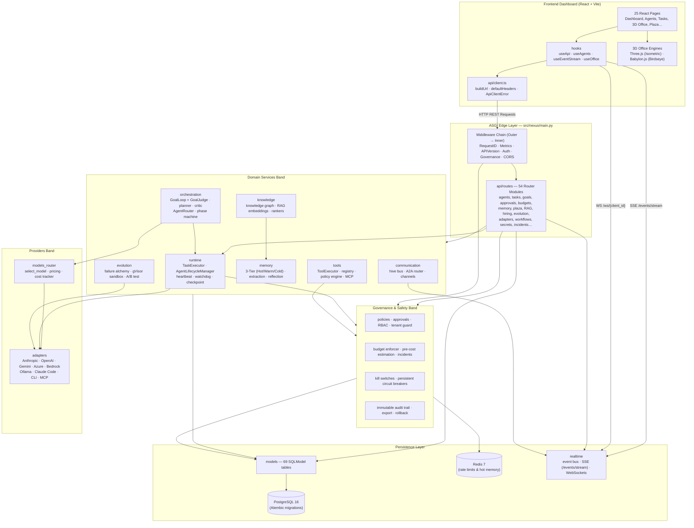

# NEXUS System Architecture

> Updated to reflect current codebase metrics: **69 SQLModel database tables**, **54 API router modules**, **25 React UI pages**, and **3,109 automated tests**.

---

## Overview

**NEXUS** is an **Autonomous AI Company Operating System** built on an async-native FastAPI backend and a React + TypeScript frontend featuring a 3D virtual office.

The system is organized into four architectural bands:

1. **Edge Band** — ASGI middleware stack (request ID, metrics, API version, governance, auth) and 54 domain router modules under `src/nexus/api/routes/`.
2. **Domain Services Band** — Agent lifecycle management, task execution, autonomous GoalLoop orchestration, tool catalog, 3-temperature memory, knowledge RAG, communication, meetings, and failure alchemy evolution.
3. **Governance & Safety Band** — Policy evaluation, approvals, budget enforcement, incident management, kill switches, persistent circuit breakers, rate limiters, RBAC, multi-tenant guard, and audit log rollback.
4. **Providers & Persistence Band** — Multi-LLM provider adapters (Anthropic, OpenAI, Gemini, Azure, Bedrock, Ollama, Claude Code), SQLModel / PostgreSQL 16 primary persistence, and Redis 7 rate-limiting and hot memory datastore.

---

## System Metrics & Tech Stack

| Aspect | Tech / Specification | Details |
| :--- | :--- | :--- |
| **Backend Runtime** | Python 3.12+ | FastAPI, Uvicorn (async throughout), Pydantic v2 |
| **Database ORM** | SQLModel (SQLAlchemy 2.0 async) | 69 table definitions, Alembic migrations |
| **Datastores** | PostgreSQL 16 & Redis 7 | PostgreSQL (primary), Redis (hot memory & rate limits) |
| **Frontend Framework** | React 18 + TypeScript | Vite, TailwindCSS, Three.js, Babylon.js |
| **API Endpoints** | 54 Router Modules | Full REST, SSE (`/events/stream`), WebSockets (`/ws/{id}`) |
| **Dashboard UI** | 25 Dedicated Pages | Complete org chart, 3D office, plaza, governance control |
| **Test Baseline** | Pytest 9.x | 3,109 passed unit & integration tests |

---

## Functional Component Matrix

### Backend (`src/nexus/`)

| Directory | Module Count | Responsibilities |
| :--- | :--- | :--- |
| `governance/` | 39 | Policy engine, approvals, persistent circuit breakers, kill switches, budget enforcer, rate limiters, audit log export & rollback, RBAC, SSRF protection |
| `api/routes/` | 54 | Router endpoints covering agents, tasks, goals, plaza, memory, RAG, hiring, evolution, budgets, approvals, HR, SSO, SCIM, telemetry |
| `models/` | 33 | 69 SQLModel table models (Company, Agent, Task, Budget, Policy, Incident, Plaza, Memory, Knowledge, Workflow, Tool, etc.) |
| `adapters/` | 17 | LLM execution adapters: Anthropic, OpenAI, Azure, Bedrock, Google Gemini, Ollama, Claude Code CLI, generic HTTP, MCP transport |
| `evolution/` | 15 | Self-improvement pipeline: Failure alchemy, prompt proposer, AST/gVisor sandbox, A/B testing framework, promoter |
| `communication/` | 14 | Hive message bus, agent-to-agent (A2A) protocol router, channels, webhook queue & handlers |
| `memory/` | 14 | 3-temperature memory architecture (Hot/Warm/Cold), semantic extraction, deduplication, reflection, promotion, compaction |
| `runtime/` | 12 | `TaskExecutor`, `AgentLifecycleManager`, heartbeat service, watchdog, checkpointing, replay, cycle guard |
| `orchestration/` | 12 | `GoalLoop` runner with independent `GoalJudge`, planner, critic, agent router, phase machine, parallel execution |
| `knowledge/` | 10 | Knowledge graph, vector embeddings, hybrid RAG retriever, BM25 ranker, document parsers, Plaza feed registry |
| `tools/` | 10 | `ToolExecutor` (permissions, rate limits, timeouts, audit), tool catalog, skills discovery, MCP stdio client |
| `models_router/` | 10 | Model router, provider registry, pricing tables, cost tracker |
| `company/` | 6 | Org chart, department & squad management, hiring, delegation, OKRs |

---

## Architecture Flow Diagram



---

## Detailed Execution Flows

### 1. ASGI Middleware Execution Flow (`src/nexus/api/middleware.py`)

Pure ASGI middleware stack executing on every HTTP request:

1. **RequestIDMiddleware**: Assigns a unique `X-Request-ID` UUID to the ASGI scope.
2. **MetricsMiddleware**: Increments Prometheus telemetry counters.
3. **APIVersionMiddleware**: Enforces API version headers (`X-API-Version`).
4. **AuthenticationMiddleware**: Resolves credentials (session cookie `nv_session` or API key `Bearer nv_...`) into a `Principal`. Rejects anonymous requests with `401 Unauthorized`.
5. **GovernanceMiddleware**:
   - Checks active **Kill Switches** (`503 KILL_SWITCH_ACTIVE`).
   - Checks **Tenant Isolation** (`company_id` scope).
   - Computes **Rate Limits** for caller tenant.
   - Evaluates **Governance Policies** (`403 POLICY_DENIED`).
   - Conducts **Pre-Execution Cost Estimation** on mutating requests (`429 BUDGET_EXCEEDED` if over limit).
   - Injects cost and rate limit response headers.

---

### 2. Autonomous Task Execution (`TaskExecutor`, `src/nexus/runtime/executor.py`)

```
Validate Permissions → Check Budget → Set status=RUNNING
  │
  ▼
Execute Adapter (`adapter.execute_task`)
  ├── Success ──► Record Token Cost ──► status=COMPLETED ──► Return TaskResult
  └── Failure ──► Retry Loop (max_retries)
                     └── On Exhaustion ──► status=FAILED ──► Failure Alchemy Processing
```

---

### 3. Goal-Gated Autonomous Loop (`GoalLoop`, `src/nexus/orchestration/goal_loop.py`)

The `GoalLoop` executes iterative goal completion with safety controls:

| Safety Valve | Trigger Condition | Outcome |
| :--- | :--- | :--- |
| **Max Iterations** | Loop reaches max specified iterations (default: 10) | Stops with `MAX_ITERATIONS_REACHED` |
| **Token Budget** | Cumulative token count exceeds budget limit | Stops with `BUDGET_EXCEEDED` |
| **Quality Threshold** | Independent `GoalJudge` approves output quality | Completes with `GOAL_SATISFIED` |
| **Emergency Halt** | Circuit breaker or kill switch trips | Halts with `EMERGENCY_HALT` |

---

## Database & Model Schemas

The 69 SQLModel tables in `src/nexus/models/` are categorized as follows:

1. **Organization & HR**: `companies`, `departments`, `teams`, `company_memberships`, `user_profiles`, `hiring_requests`, `workspaces`, `okrs`, `objectives`, `key_results`.
2. **Agents & Runtime**: `agents`, `agent_skills`, `agent_logs`, `agent_profiles`, `archetypes`, `heartbeat_runs`, `watchdog_events`.
3. **Tasks & Execution**: `tasks`, `goals`, `projects`, `task_dependencies`, `workflow_runs`, `pipelines`, `pipeline_runs`.
4. **Knowledge & Collaboration**: `plaza_posts`, `plaza_reactions`, `knowledge_documents`, `knowledge_chunks`, `embeddings`, `repositories`.
5. **Memory Store**: `memory_records`, `hot_memories`, `warm_memories`, `cold_archives`.
6. **Governance & Safety**: `approvals`, `decisions`, `budget_policies`, `cost_events`, `incidents`, `kill_switches`, `circuit_breakers`, `audit_logs`, `policies`, `secrets`, `api_keys`, `company_settings`, `notification_preferences`, `notifications`.
7. **Evolution**: `failure_patterns`, `prompt_proposals`, `sandbox_runs`, `ab_test_runs`, `promoted_prompts`.
