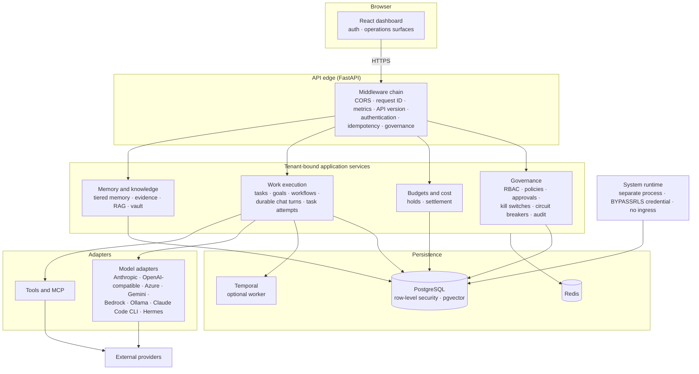

# NEXUS

A self-hosted operating and governance system for a durable AI workforce: organize agents, assign work, control authority and spend, preserve institutional memory, and verify results.

[](https://github.com/naviyanka/NVLabsCompany/actions/workflows/test.yml)
[](https://www.python.org)
[](dashboard/README.md)

NEXUS is an application and control plane above model providers and agent runtimes, not another agent framework. The unit of work is a company: agents are hired into an organization, act under governed authority, spend against budgets inside tenant-isolated infrastructure, and produce results that are verified and audited.

## Status

**NEXUS is pre-release software** (version 0.1.0; no tags or releases are published). Current `main` carries substantial tested infrastructure, and development is active:

- The unified, text-first verified work loop is under active development in draft [PR #69](https://github.com/naviyanka/NVLabsCompany/pull/69) and is not merged. The task, goal, manager, employee, and CEO subsystems already on `main` are the building blocks for it, not the final unified experience.
- Browser voice and channel gateways are not implemented on `main`. Azure provider foundations exist but are disabled by default (see the [provider matrix](#provider-and-runtime-matrix)).
- Production operation requires explicit configuration and external infrastructure, described in [Production deployment](#production-deployment).
- Do not treat this repository as an unattended production deployment without review.

## What NEXUS does

Capabilities present on current `main`, described by product outcome:

- **Companies and organization** — companies as tenants, departments and squads, hiring from agent templates, human user invitations, org snapshots.
- **Agents and provider adapters** — an agent workforce with selectable model/runtime adapters (Anthropic, OpenAI-compatible, Azure OpenAI, Gemini, Bedrock, Ollama, Claude Code CLI, Hermes, generic HTTP, MCP).
- **Governance and approvals** — RBAC, policy evaluation, autonomy levels with notifications and approval gates, tool policy and binding enforcement, kill switches and circuit breakers.
- **Budgets and cost accounting** — per-company spending limits with pre-execution checks, holds and settlement per model call, cost events.
- **Memory lifecycle** — tiered memory (hot/warm/cold), memory graph and global memory, evidence and governed trust promotion, optional Obsidian vault integration.
- **Tasks, goals, and workflows** — task management, goal and OKR tracking, workflow and pipeline execution, cron and webhook triggers.
- **Durable work execution** — employee chat turns and task attempts that survive restarts, run in per-company isolated worktrees, and record verification evidence.
- **Audit and incidents** — a hash-chained audit log per company, incident tracking, activity feeds.
- **System runtime and tenant isolation** — a dedicated process for cross-tenant maintenance; PostgreSQL row-level security with separated database roles.
- **Dashboard** — operations surfaces for overview, agents, work, organization, governance, budgets, memory, knowledge, and audit, with first-run setup, login, and invite flows.

### Capability status

| Capability | State on `main` |
| :--- | :--- |
| Companies, tenancy, org structure, hiring, invites | Available |
| Agents with provider/runtime adapters | Available (per-provider status varies; see matrix below) |
| Governance, approvals, budgets, audit, incidents | Available |
| Memory lifecycle with evidence and trust promotion | Available, still being extended in phases |
| Tasks, goals, OKRs, workflows, pipelines, triggers | Available |
| Durable chat turns and task attempts with worktree isolation | Available |
| Unified text-first verified work loop (single work surface) | In draft PR #69, not merged |
| System runtime and PostgreSQL role separation | Available |
| Azure OpenAI governed provider | Present, disabled by default |
| Azure Speech STT/TTS | Present, disabled by default, no consumer yet |
| Browser voice, Teams/Telegram gateways | Not implemented |
| Legacy inbound Slack/Telegram channels | Disabled (returns 410) |
| Obsidian vault integration | Available, opt-in via configuration |

## Core product journey

What current `main` supports, end to end:

1. Start the stack and open the dashboard. First-run setup creates the primary administrator and the company workspace; afterwards accounts are created by invitation only.
2. Define the organization: departments and squads, then hire agents from templates into it.
3. Assign work: create tasks and goals, chat with an employee agent, or delegate through managers. A chat turn is durable — it is claimed, leased, and recovered by a worker if a process dies. A task attempt runs in an isolated worktree, executes verification commands, and stores its evidence under a per-company root.
4. Governed actions: an agent call's autonomy level decides whether a notification or a human approval is required; every model call reserves and settles budget.
5. Review results: the approvals queue, the audit log, incidents, and activity feeds.

The CEO → manager → employee loop above is real but currently exercised through separate task, goal, and role subsystems. The unified text-first work loop that ties it into one surface is in draft PR #69; after it merges, this section will be updated in the rebase.

## Architecture



How the pieces map to isolation boundaries:

- **Application role (`nexus_app`)** — the runtime identity for the API and workers. It owns nothing in the database and is bound by forced row-level security; every tenant-scoped query runs in a tenant session that sets the company context per transaction. The caller's tenant always comes from the authenticated credential, never from a request header.
- **Migrator role (`nexus_migrator`)** — owns the schema and runs Alembic in a one-shot migration job. A runtime process handed the migration credential refuses to start.
- **System role (`nexus_system`)** — the only identity with `BYPASSRLS`, held exclusively by the system-runtime process, which publishes no ports. It discovers which tenants need maintenance and publishes work hints; company data is only ever touched through tenant sessions.
- **Fail-closed startup** — configuration validators refuse to start on a disallowed `AUTH_ENABLED=false`, a misplaced migration or system credential, or a webhook timeout that would outlive the idempotency lease.
- **Operator-only provider configuration** — Azure and Hermes-native provider settings and credentials can only come from operator configuration, never from agent configuration; agents cannot aim provider settings at another host.

## Safety and governance

- **Authentication** — session cookie (httpOnly, DB-backed, with CSRF token on mutating requests) or tenant-scoped API keys. Disabling authentication is refused outside test environments, and in development only with an explicit acknowledgement.
- **Authorization** — RBAC roles, per-company policy evaluation, autonomy levels (level 2 sends a notification before the call; level 3 requires approval).
- **Tool policy** — tool access control with binding enforcement on by default; MCP and declared tool schemas are validated before dispatch.
- **Budgets** — hard and soft caps per company with pre-execution checks (`429 BUDGET_EXCEEDED`), holds that reserve before a call and settle from authoritative usage.
- **Audit** — an append-only, hash-chained audit log per company; system events without a tenant are refused rather than written unchained.
- **Emergency controls** — tenant-scoped and global kill switches, plus circuit breakers that persist across restarts.
- **Network and secrets** — SSRF guards on outbound URLs with an operator allowlist for internal hosts; a secret backend (encrypted-at-rest by default) for credentials; no API key is ever a setting or an agent field for the governed Azure provider.
- **Idempotency** — mutating requests carry an idempotency middleware so a retried request does not double-apply.

### Durable tool-effect recovery

Employee chat turns are ledgered for tool effects: every tool declares its effect class, a write with an unknown outcome after an interruption is never silently repeated, proven-idempotent writes retry automatically, and a non-idempotent write with unknown outcome waits for an explicit operator decision through admin-only routes. Notifications sent for gated calls are at-most-once.

Known boundaries of this guarantee: it covers ledgered chat-turn paths only — REST node calls and background task attempts are outside it (task attempts carry their own idempotency keys), a recovered turn that already wrote cannot make further writes, and operator resolution may be required for ambiguous non-idempotent calls. Details and operator procedures: [docs/runbooks/tool-effect-recovery.md](docs/runbooks/tool-effect-recovery.md).

## Provider and runtime matrix

Providers found in source, with their status on current `main`. "Live-validated" refers only to the acceptance records linked below.

| Provider / runtime | Status on `main` | Configuration | Notes |
| :--- | :--- | :--- | :--- |
| Anthropic | Available | API key / company connections | Streaming chat adapter on the API chat path |
| OpenAI-compatible | Available | API key / company connections | Also the wire format for self-hosted gateways |
| Azure OpenAI (native) | Disabled by default | Operator-only `AZURE_OPENAI_*` settings, Entra auth default | Governed streaming tool loop; Entra scope and one end-to-end call live-validated ([acceptance record](docs/testing/evidence/azure-openai-entra/ACCEPTANCE.md)); production enablement is a separate decision and managed identity is unverified |
| Azure OpenAI (legacy adapter) | Present, not recommended | API-key header | Non-streaming, not eligible for governed tool use; retained pending a removal decision |
| Azure Speech (STT/TTS) | Disabled by default, no consumer yet | Operator-only `AZURE_SPEECH_*` settings, Entra only | Transport only, optional `speech` extra; browser/gateway wiring is future work; scope live-validated for recognition and synthesis ([acceptance record](docs/testing/evidence/azure-speech-provider/ACCEPTANCE.md)) |
| Google Gemini | Adapter present | Company connections | Not live-validated |
| AWS Bedrock | Adapter present | Company connections | Not live-validated |
| Ollama | Adapter present | Local endpoint | Local and open-weight models |
| Claude Code CLI | Adapter present | Installed CLI binary | Runs the CLI as an employee backend; detection via the adapters API |
| Hermes | Adapter present; native governed provider disabled by default | Operator-only `HERMES_NATIVE_*` settings | Governed tool turns behind operator configuration (ADR 0005, proposed) |
| OmniRoute gateway | Optional (`gateway` compose profile) | Company connection + SSRF allowlist | Self-hosted LLM gateway; not started by default |
| MCP / generic tools | Available | Tool registry, MCP bindings | External tools default to the most conservative effect class |

## Quick start: local evaluation

Requirements: Docker and Docker Compose v2. (Manual Python/Node setup is documented in [INSTALLATION.md](INSTALLATION.md).)

```bash
git clone https://github.com/naviyanka/NVLabsCompany.git
cd NVLabsCompany
docker compose up -d
```

This starts PostgreSQL (with pgvector), Redis, Temporal with its UI, a one-shot migration service, the API, the Temporal worker, the system runtime, and the dashboard. Migrations run before the API accepts traffic.

```bash
# Verify the API is up
curl http://localhost:8000/health
```

| Surface | URL |
| :--- | :--- |
| Dashboard | http://localhost:3000 |
| First-run setup | http://localhost:3000/setup |
| API | http://localhost:8000 |
| API docs (Swagger) | http://localhost:8000/docs |
| Temporal UI | http://localhost:8088 |

Open the dashboard and complete setup to create the first administrator; `/setup` locks afterwards and further users join by invitation. On first start the server also seeds a default company with demo data for evaluation.

Notes:

- `docker-compose.yml` ships development-only default database credentials. They exist so the stack boots with no configuration; never reuse them outside local evaluation.
- Authentication is enabled by default. Disabling it is refused except in test environments, and in development only with an explicit acknowledgement — do not treat it as a normal path.
- To stop and keep data: `docker compose down`. To stop and discard volumes: `docker compose down -v`.
- An optional self-hosted LLM gateway is available behind the `gateway` profile: `docker compose --profile gateway up`.

## Production deployment

There is no one-command production deployment. A production install is an operator exercise with explicit prerequisites:

- **Separate PostgreSQL roles**, provisioned by an administrator before the first start: schema owner (`nexus_migrator`), application role (`nexus_app`, owns nothing, RLS-bound), and the `BYPASSRLS` system role held only by the system runtime. Nothing creates roles or schema implicitly.
- **A migration credential** used only by the one-shot migration job, and application credentials that refuse to start if they carry migration or system secrets.
- **Redis** (password-protected), **Temporal** if workflow durability is used, a **secret backend**, and **TLS/ingress** in front of the API and dashboard.
- **Authentication enabled** and provider configuration set by the operator.
- **Backups, monitoring, and a migration/rollback review.** The tool-effect ledger's downgrade is refused while recovery records exist; read [docs/runbooks/tool-effect-recovery.md](docs/runbooks/tool-effect-recovery.md) before planning rollbacks.

Entry points:

- Production Compose with the four-env-file credential layout: [docker-compose.prod.yml](docker-compose.prod.yml) (examples: [.env.postgres.example](.env.postgres.example), [.env.migration.example](.env.migration.example), [.env.production.example](.env.production.example), [.env.system.example](.env.system.example))
- Helm chart: [deploy/helm/nexus](deploy/helm/nexus) (linted and schema-validated in CI)
- Runbooks: [database roles](docs/runbooks/database-roles.md), [system runtime](docs/runbooks/system-runtime.md), [tool-effect recovery](docs/runbooks/tool-effect-recovery.md)
- Environment and ports: [docs/ENVIRONMENT.md](docs/ENVIRONMENT.md)

Known operational limitations are listed under [Known limitations](#known-limitations). The image build is validated in CI (multi-architecture build, Trivy scan, import smoke for the Azure runtime), but no external production operation is claimed as certified.

## Testing

CI (`.github/workflows/test.yml`) is authoritative for what is verified on every push and pull request:

- **Backend** — the pytest suite on SQLite, excluding PostgreSQL-marked files.
- **PostgreSQL integration** — the PostgreSQL/RLS/migration files against a real pgvector service, including a full Alembic `upgrade → downgrade → upgrade` cycle, role-separation and tenant-isolation proofs.
- **Frontend** — TypeScript typecheck, Vitest, and a production Vite build.
- **API parity** — the same endpoint spec run against a mock server and the real FastAPI backend.
- **End-to-end** — a separate Playwright workflow.
- **Compose boot smoke** — the stack must boot and report healthy.
- **Container and security checks** — offline Azure Speech SDK smoke, multi-architecture production image build with a Trivy scan, ruff (ratcheted), bandit, hadolint, Helm lint/kubeconform, and the architecture, generated-artifact, and test-invocation guard scripts.

For memory-bounded local runs, use the sequential chunk runner:

```bash
python scripts/run_pytest_chunks.py            # default: excludes PostgreSQL-marked files
python scripts/run_pytest_chunks.py --list     # show the plan without running
python scripts/run_pytest_chunks.py --postgres-only   # needs external PostgreSQL setup
```

It runs one pytest subprocess per chunk, strictly sequentially, and validates that no parallel options arrive through the environment or repository config. It is a local helper, not a CI replacement: it sees only what you select, on your environment. Documentation: [docs/testing/PYTEST_CHUNK_RUNNER.md](docs/testing/PYTEST_CHUNK_RUNNER.md). No test totals are quoted here by design; CI results are the source of truth.

## Repository structure

| Directory | Contents |
| :--- | :--- |
| `src/nexus` | Backend application: API routes, adapters, governance, memory, runtime, orchestration, tools, knowledge, voice, system runtime |
| `dashboard` | React + TypeScript operations dashboard |
| `alembic` | Database migrations |
| `tests` | Pytest suite (PostgreSQL-marked files run in the CI integration job) |
| `deploy` | Helm chart, PostgreSQL role provisioning, Prometheus/Grafana configuration |
| `docker` | Container support files (Postgres init, Speech smoke) |
| `docs` | ADRs, runbooks, provider and testing documentation, historical plans and audits |
| `scripts` | Guard scripts, the pytest chunk runner, operator utilities |
| `e2e` | Playwright end-to-end and API-parity specs |

## Documentation

- **Getting started** — [INSTALLATION.md](INSTALLATION.md) · [API_GUIDE.md](API_GUIDE.md) · [FEATURES.md](FEATURES.md) · [dashboard/README.md](dashboard/README.md)
- **Architecture** — [ARCHITECTURE.md](ARCHITECTURE.md) · [ADRs](docs/adr/): [0001 single execution path](docs/adr/0001-single-execution-path.md), [0002 knowledge ownership](docs/adr/0002-knowledge-ownership-boundary.md), [0003 CEO control plane](docs/adr/0003-ceo-control-plane.md), [0005 Hermes governed tools](docs/adr/0005-hermes-native-governed-tools.md), [0006 Azure conversational CEO](docs/adr/0006-azure-conversational-ceo.md) · [component matrix](docs/architecture/component-matrix.md)
- **Operations** — [environment and ports](docs/ENVIRONMENT.md) · [CI baseline](docs/CI_BASELINE.md) · [selective builds](docs/CI_SELECTIVE_BUILDS.md)
- **Runbooks** — [database roles](docs/runbooks/database-roles.md) · [system runtime](docs/runbooks/system-runtime.md) · [tool-effect recovery](docs/runbooks/tool-effect-recovery.md)
- **Governance and security** — [tenant session audit](docs/security/TENANT_SESSION_AUDIT.md) · [ingress auth and webhooks](docs/security/INGRESS_AUTH_AND_WEBHOOKS.md) · [legacy channel ingress](docs/security/LEGACY_CHANNEL_INGRESS.md) · [CEO orchestration guide](docs/ceo-orchestration-guide.md)
- **Providers** — [Azure OpenAI](docs/azure-openai-provider.md) · [Azure Speech](docs/azure-speech-provider.md)
- **Testing** — [chunk runner](docs/testing/PYTEST_CHUNK_RUNNER.md) · [suite inventory](docs/testing/TEST_SUITE_INVENTORY.md) · [known baseline failures](docs/testing/KNOWN_BASELINE_FAILURES.md) · [employee core testing](docs/testing/EMPLOYEE_CORE_TESTING.md) · [acceptance evidence](docs/testing/evidence/)
- **Contributing** — [CONTRIBUTING.md](CONTRIBUTING.md) · [AGENTS.md](AGENTS.md)

`docs/` also contains dated planning and audit documents (for example [docs/FINAL-STATUS-SUMMARY.md](docs/FINAL-STATUS-SUMMARY.md), [docs/PRODUCTION-READINESS-AUDIT.md](docs/PRODUCTION-READINESS-AUDIT.md), [docs/COMPARISON_REPORT.md](docs/COMPARISON_REPORT.md)). These are historical records of past points in time and are not maintained as current status.

## Known limitations

- No tagged release exists; this is pre-release software.
- The unified text-first verified work loop is in draft PR #69; today's task, goal, and role subsystems are its building blocks.
- Browser voice and channel gateways are not implemented; the Azure Speech transport has no consumer yet.
- The Azure OpenAI and Azure Speech providers are disabled by default, and their production enablement (managed identity, service principals) is unvalidated.
- The memory lifecycle is being built out in phases: evidence and governed trust promotion are merged; later phases are not.
- Legacy inbound Slack/Telegram channels are disabled (410) pending a channel-to-tenant binding design; outbound notifications remain available.
- The tool-effect recovery guarantee has defined path boundaries (chat-turn ledgered paths only; see the runbook).
- A Ruff lint baseline remains and is ratcheted in CI (`scripts/ruff_baseline.json`).
- SQLModel is pinned below 0.0.45 until a deliberate timezone-aware migration ([docs/CI_BASELINE.md](docs/CI_BASELINE.md)).
- Startup seeds demo data for evaluation, and some dashboard surfaces include demo or fallback content.
- External production operation has not been certified, and no third-party security review is claimed.

## Contributing

See [CONTRIBUTING.md](CONTRIBUTING.md). In short:

- Changes require tests; CI is authoritative.
- Migrations must keep a single Alembic head; CI replays the full chain against real PostgreSQL.
- Security and tenant isolation are mandatory review dimensions; the repository enforces them with guard scripts and RLS tests, not convention alone.

## License

There is no `LICENSE` file at the repository root yet. Package metadata currently declares MIT; a root license file should be added before public release.
