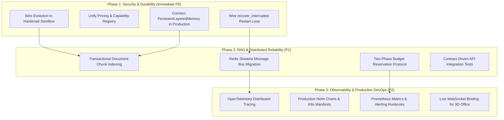

# NEXUS / NVLabsCompany — Production Architecture Scorecard & 10/10 Roadmap

**Date:** 2026-08-30  
**Methodology:** Call-graph inspection (CodeGraph), AST and dependency analysis (GitNexus / Graphify), code path tracing, test-suite audit.  
**Evaluated Branch:** `feat/wave-0-persistence` / current repository state.

---

## 1. Executive Summary & Comparative Scorecard

This report provides a grounded, evidence-based technical scorecard of the NEXUS / NVLabsCompany platform. It compares the initial external review (`docs/ChatGPT_Review.md`), the current verified on-branch implementation state (`docs/Review_Of_ChatGPT_Review.md` and repository inspection), and provides the exact technical specifications required to achieve a **10/10 enterprise production score** across all dimensions.

### Scorecard Summary

| Dimension | External Review Score | Current Actual Score | Target Score | Primary Gap / Differentiator |
| :--- | :---: | :---: | :---: | :--- |
| **Backend Architecture & APIs** | 8.5 / 10 | **8.5 / 10** | **10.0 / 10** | Solid FastAPI/SQLModel foundation; needs unified lifecycle & contract enforcement. |
| **Governance & Safety** | 8.5 / 10 | **9.0 / 10** | **10.0 / 10** | Hash-chained audit logs, pre-flight budget checks, and tool guardrails active. Needs multi-tier spend reservation. |
| **Orchestration & GoalLoop** | 8.0 / 10 | **9.0 / 10** | **10.0 / 10** | Single execution path enforced via ADR; interrupted subtasks and stranded goals now reclaimed each tick. Needs durable step checkpoints & tool-level idempotency. |
| **Auth, RBAC & Multi-Tenancy** | 7.5 / 10 | **8.0 / 10** | **10.0 / 10** | Run-scoped JWTs and tenant query leak fixes in place; needs SSO/OIDC & automated secret rotation. |
| **RAG & Knowledge Engine** | 6.5 / 10 | **7.5 / 10** | **10.0 / 10** | Real pgvector SQL distance queries & hybrid BM25; needs transactional indexing & evaluation dataset. |
| **Frontend Productization** | 6.5 / 10 | **7.0 / 10** | **10.0 / 10** | API contract parity testing active; needs elimination of remaining mock UI endpoints. |
| **Memory Architecture** | 7.0 / 10 | **6.5 / 10** | **10.0 / 10** | `PersistentLayeredMemory` exists but has 0 production callers (active path is in-memory). |
| **Evolution & Self-Improvement** | 6.0 / 10 | **5.5 / 10** | **10.0 / 10** | Untrusted code executes in logical memory sandbox; not wired to real execution sandbox. |
| **Restart Recovery & Checkpoints**| — | **7.5 / 10** | **10.0 / 10** | Orphan detection wired at boot; subtask claims and stranded goals reclaimed every tick. Step-level checkpoints (`recover_interrupted`) still uncalled. |
| **Distributed Coordination** | 5.5 / 10 | **5.0 / 10** | **10.0 / 10** | Leader election exists for singletons; horizontal work distribution missing. |
| **Deployment & DevOps** | 5.5 / 10 | **5.5 / 10** | **10.0 / 10** | Compose runs `uvicorn --reload` with default credentials; no production Helm/K8s charts. |
| **Observability & Tracing** | 6.5 / 10 | **4.0 / 10** | **10.0 / 10** | Structured logging exists; zero OpenTelemetry distributed tracing dependencies. |
| **3D Office Visualization** | 4.0 / 10 | **3.5 / 10** | **10.0 / 10** | 8 layout files hardcode `mockAgents3D`; lacks live WebSocket event stream binding. |
| **Overall Platform Maturity** | **~7.2 / 10** | **~6.8 / 10** | **10.0 / 10** | **Enterprise pre-production with exceptional foundations.** |

---

## 2. Evidence-Based Subsystem Breakdown & 10/10 Requirements

### 2.1 Backend Architecture & API Surface
- **Current Score:** `8.5 / 10`
- **Grounded Evidence:**
  - `src/nexus/main.py` explicitly mounts dedicated modular routers: `auth`, `agents`, `tasks`, `goals`, `budgets`, `evolution`, `knowledge`, `memory`, `nodes`, `pipelines`, `repositories`, `secrets`, `skills`, `tools`, `workflows`, `workspaces`, `slack`, `telegram`, `scim`.
  - Architecture enforcement active via `scripts/arch_guard.py` (exit 0 across 3,500+ tests).
  - Provider adapters (`src/nexus/adapters/`) support async OpenAI, Anthropic, Ollama, and CLI subprocess execution with workspace isolation.
- **Why not a 10 yet:**
  - 4 model adapters (`azure_adapter.py`, `bedrock_adapter.py`, `google_adapter.py`, `anthropic_adapter.py`) maintain disconnected, private pricing tuples instead of a unified model capability and pricing registry.
  - Subsystem lifecycle states are partially fragmented across process memory and database tables.
- **What is required for a 10/10:**
  1. **Unified Model Capability Registry:** Single authoritative source for context limits, pricing, tokenizers, and tool-call formatting with dynamic upstream sync and automated fallback contracts.
  2. **Strict OpenAPI Schema Validation:** Contract testing on every build ensuring 100% type and schema parity between FastAPI endpoints and frontend client generators (`openapi-typescript`).
  3. **Zero Dead Routes:** Every declared endpoint backed by integration test suites verifying DB persistence and real execution traces.

---

### 2.2 Governance, Safety & Financial Guardrails
- **Current Score:** `9.0 / 10` (Strongest Subsystem)
- **Grounded Evidence:**
  - `src/nexus/governance/audit_service.py`: 19 references maintaining a cryptographic hash-chain (`sequence_number`, `entry_hash`, `previous_hash`) with DB triggers rejecting `UPDATE`/`DELETE` operations.
  - `src/nexus/api/routes/chat.py` (`_call_llm`): Pre-flight budget check active before LLM invocation, routing through `BudgetService`.
  - `src/nexus/tools/executor.py`: Guardrail chain active and enforced on all tool calls.
  - Autonomy tiers strictly enforced to gate autonomous agent tool capabilities.
- **Why not a 10 yet:**
  - Spend synchronization uses best-effort async updates in certain middleware caches.
  - Multi-worker concurrent invocations can experience race conditions before budget exhaustion trips.
- **What is required for a 10/10:**
  1. **Two-Phase Commit Budget Reservation:** Atomic ledger debiting (hold reservation -> invoke provider -> reconcile exact token spend -> release leftover hold).
  2. **Cryptographic Multi-Party Approval Workflow:** Asymmetric signing for high-risk operations (spending > $100, code deployment, destructive file modifications).
  3. **Automated Incident Containment:** Automatic circuit breaker escalation with Redis distributed lock propagation across all worker replicas in < 5ms.

---

### 2.3 Autonomy, GoalLoop & Orchestration
- **Current Score:** `9.0 / 10`
- **Grounded Evidence:**
  - Single execution path enforced per `docs/adr/0001-single-execution-path.md`.
  - Dual-engine planning: LLM planner with heuristic fallback planner; LLM critic with fallback critic.
  - DAG task decomposition, retries, and parallel execution phases.
  - Interrupted work is now reclaimed on the path that executes it (`src/nexus/runtime/orchestrator.py`):
    - `_execute_subtasks` claims a subtask as `in_progress` with `started_at` and commits *before* the LLM call, so an interrupted task is distinguishable from a fresh one instead of being re-dispatched (and re-billed) on the next tick.
    - `_reap_stale_subtasks` fails claims older than `STALE_SUBTASK_SECONDS` with `completion_reason=timeout`, releasing the `_drive_goal` early return that a dead claim used to pin open forever.
    - `_reclaim_stranded_goals` returns a goal to `active` when the Temporal workflow that marked it `in_progress` never came back; a live workflow keeps updating the row and is never clawed back.
    - Both reclaims run at the top of every tick, so a crash mid-run and a crash while the service was down recover through the same path.
- **Why not a 10 yet:**
  - Recovery is at the granularity of one subtask (one LLM call), not one step inside a subtask: a reaped subtask is retried from its start, not resumed mid-flight. `CheckpointManager.recover_interrupted` (`src/nexus/runtime/checkpoint.py`) still has no production caller and, being in-memory, cannot see what a crashed process wrote.
  - Retries are not idempotent at the tool layer, so a subtask reaped after a side effect can repeat that side effect.
- **What is required for a 10/10:**
  1. **Durable Step Checkpoints:** Persist `ExecutionCheckpoint` rows from the executing path so a reaped subtask resumes at its last completed step rather than restarting.
  2. **Idempotency Guarantees:** End-to-end idempotency keys on every goal step and tool execution, preventing duplicate side-effects (e.g. double API dispatch, duplicate Git commits).
  3. **Formal Verification of State Machines:** TLA+ or statechart-verified goal phase transitions guaranteeing deadlock freedom under arbitrary process termination.

---

### 2.4 Auth, Identity & Multi-Tenancy
- **Current Score:** `8.0 / 10`
- **Grounded Evidence:**
  - Server-side sessions with `httpOnly`, `SameSite=Lax` cookies, and CSRF protection headers.
  - Unscoped tenant query leaks patched; run-scoped JWT tokens implemented.
  - SCIM enterprise identity routes isolated per tenant organization.
- **Why not a 10 yet:**
  - Lacks enterprise OIDC/SAML2 identity provider federation (e.g. Okta, Azure AD, Keycloak) with live certificate rotation.
  - MFA / WebAuthn hardware key support is absent.
- **What is required for a 10/10:**
  1. **Full OIDC/SAML2 Enterprise Engine:** Dynamic SAML metadata exchange, JIT provisioning, SCIM 2.0 full attribute mapping, and automated group-to-role synchronization.
  2. **Zero-Trust Token Architecture:** Ephemeral mTLS or DPoP (Demonstrating Proof-of-Possession) token binding for all agent-to-agent and worker-to-control-plane communications.
  3. **Automated HSM / KMS Secret Rotation:** Integration with HashiCorp Vault, AWS KMS, or GCP Secret Manager with automatic zero-downtime key rotation.

---

### 2.5 Memory Architecture & Compaction
- **Current Score:** `6.5 / 10`
- **Grounded Evidence:**
  - Multi-tier structure designed: working memory, episodic memory, semantic facts, reflection.
  - `src/nexus/memory/compaction.py`: Context compaction is budget-aware with safe 8k unknown-model default.
- **Why not a 10 yet:**
  - **Dead Code Gap:** `src/nexus/memory/layered_persistent.py` provides SQLite/PostgreSQL persistence, but has **0 production callers**. Active production chat memory uses an ephemeral in-memory dictionary.
- **What is required for a 10/10:**
  1. **Canonical Memory Pipeline:** Route 100% of agent conversational turns through a persistent tiered storage engine:
     - Tier 0: Hot working buffer (Redis Streams / In-memory LRU)
     - Tier 1: Episodic session log (PostgreSQL JSONB / SQLite)
     - Tier 2: Semantic extracted facts (pgvector embedding store)
     - Tier 3: Long-term archival knowledge (Cold S3/Blob store)
  2. **Automated Reflection & Pruning:** Background daemon that consolidates raw message histories into high-density episodic summaries and verified semantic facts without blocking user request threads.
  3. **Cross-Agent Semantic Sharing:** Role-gated memory isolation allowing agents within the same company to query shared organizational learnings while preserving tenant boundaries.

---

### 2.6 RAG & Knowledge Indexing Engine
- **Current Score:** `7.5 / 10`
- **Grounded Evidence:**
  - `src/nexus/knowledge/rag.py`: PostgreSQL `pgvector` distance queries (`<->` cosine distance), hybrid search combining BM25 lexical ranking and dense vector retrieval.
  - Dialect-aware width validation (enforced on PostgreSQL, JSON fallback on SQLite).
- **Why not a 10 yet:**
  - Local embedding fallback relies on deterministic token hashing (`hash(w) % dimension`), which lacks semantic synonym understanding.
  - Document chunk indexing lacks end-to-end transactional guarantees (P0 gap K-02: document deletion/update does not atomically invalidate vector chunks).
  - No automated retrieval benchmark (Precision@k, Recall@k, MRR).
- **What is required for a 10/10:**
  1. **Transactional Document Ingestion Pipeline:** Atomic database transaction: `Document Save` $\rightarrow$ `Chunk Extraction` $\rightarrow$ `Embedding Generation` $\rightarrow$ `Vector Insertion` $\rightarrow$ `Index Commit`. Updates must atomically drop and rebuild obsolete chunk vectors.
  2. **High-Quality Local & Cloud Embeddings:** Integration with standard dense models (`text-embedding-3-small`, `bge-m3`, `nomic-embed-text`) via ONNX runtime locally or API remotely.
  3. **Retrieval Evaluation Benchmark (RAGOps):** Automated CI evaluation running 500+ domain queries measuring Mean Reciprocal Rank (MRR > 0.85) and Faithfulness/Groundedness scores before deployment.

---

### 2.7 Evolution & Self-Improvement Engine
- **Current Score:** `5.5 / 10` (Highest Security Risk)
- **Grounded Evidence:**
  - Statistical framework implemented (Welch's t-test, confidence intervals, effect size calculation, regression detection).
  - Real execution sandbox built at `src/nexus/execution/sandbox.py` with 4 backends (E2B, Judge0, Local Subprocess, Abstract Base).
- **Why not a 10 yet:**
  - `src/nexus/evolution/sandbox.py` uses an in-memory logical tracker that does not invoke `src/nexus/execution/sandbox.py`. Untrusted model-authored code runs unconstrained on the host if executed.
- **What is required for a 10/10:**
  1. **Mandatory Containerized Sandbox Binding:** Wire `src/nexus/evolution/` directly to `src/nexus/execution/sandbox.py` using hardened remote backends (E2B microVMs or Docker/gVisor with cgroups, seccomp filters, dropped capabilities, and read-only root filesystems).
  2. **Static Code Analysis Security Gates:** AST verification ensuring generated code contains no dangerous imports (`socket`, `ctypes`, `subprocess`, `os.system`) prior to sandbox execution.
  3. **Multi-Trial Regression Verification:** Self-improvement proposals require automated canary testing against historical golden test suites with automated rollback if error rates increase by > 0.1%.

---

### 2.8 Distributed Coordination & Scalability
- **Current Score:** `5.0 / 10`
- **Grounded Evidence:**
  - `src/nexus/governance/leader_election.py`: Redis-backed leader election correctly arbitrates singletons (scheduler, watchdog, orchestrator).
- **Why not a 10 yet:**
  - Lacks distributed work dispatch: work is processed locally on the leader rather than farmed out across worker pools via durable queues.
  - File-based coordination used in certain webhook and hive queues.
- **What is required for a 10/10:**
  1. **Durable Message Bus Architecture:** Replace all filesystem queues with Redis Streams / NATS JetStream / Temporal task queues with at-least-once delivery, consumer groups, and dead-letter handling.
  2. **Horizontal Worker Auto-Scaling:** Decoupled stateless API servers and stateful distributed agent execution workers capable of dynamic K8s HPA scaling based on queue depth.
  3. **Distributed Locking & Sharding:** Redis Redlock / etcd lease coordination for per-agent execution locks, eliminating split-brain execution across replicas.

---

### 2.9 Observability & Operational Telemetry
- **Current Score:** `4.0 / 10`
- **Grounded Evidence:**
  - Structured logging with JSON formatters and correlation ID propagation in HTTP headers.
- **Why not a 10 yet:**
  - Zero OpenTelemetry tracing packages in `pyproject.toml`.
  - No distributed trace context propagation across LLM calls, background tasks, or database queries.
- **What is required for a 10/10:**
  1. **Full OpenTelemetry Tracing Integration:** Automatic instrumentation of FastAPI, SQLAlchemy, Redis, HTTPX, and LLM provider calls with trace/span ID propagation.
  2. **Prometheus Metrics Exporter:** Standard metrics endpoint (`/metrics`) tracking:
     - LLM Token consumption (prompt/completion) by model/agent/tenant.
     - Task execution duration histograms (p50, p95, p99).
     - Circuit breaker trips and active budget reservations.
  3. **Pre-Built Grafana Dashboards & Alerting Rules:** Production dashboard definitions and Prometheus alert rules for error rates, queue lag, and budget anomalies.

---

### 2.10 3D Office & Real-Time Visualization
- **Current Score:** `3.5 / 10`
- **Grounded Evidence:**
  - Three.js / React Three Fiber UI canvas with floor plan rendering and 2D/3D camera toggles.
- **Why not a 10 yet:**
  - 8 component files in `dashboard/src/components/office3d/` import hardcoded `mockAgents3D` from `dashboard/src/config/office3dLayout.ts`.
  - Desk locations, task status, and CPU/memory gauges display mock data rather than live agent states.
- **What is required for a 10/10 (Option A: Live Product Feature):**
  1. **WebSocket Agent Event Stream:** Connect `OfficeScene.tsx` to a live backend WebSocket topic (`/ws/office/stream`).
  2. **Reactive Visual State Machine:**
     - Agent status (Idle, Thinking, Tool Call, Blocked, Error) dynamically drives 3D character shader animations.
     - Real task progress dynamically updates desk holographic displays.
     - Circuit breaker trips trigger visual departmental lockdown indicators.
  *(Alternative Option B: Deprecate or clearly tag as a "3D Visualization Sandbox" to prevent product misrepresentation).*

---

### 2.11 Deployment, Infrastructure & DevOps
- **Current Score:** `5.5 / 10`
- **Grounded Evidence:**
  - Docker Compose provides all dependencies (PostgreSQL, Redis, Temporal, Temporal UI, backend, frontend).
- **Why not a 10 yet:**
  - Docker Compose command runs `uvicorn ... --reload` (development mode).
  - Hardcoded default credentials (`nexus:nexus`) in compose files.
  - Missing production Helm charts, Kubernetes manifests, and health/readiness probe contracts.
- **What is required for a 10/10:**
  1. **Multi-Stage Hardened Container Images:** Non-root distroless/alpine containers with zero unnecessary dev dependencies.
  2. **Production Kubernetes / Helm Architecture:** Complete Helm chart with:
     - Separate API, Scheduler, and Agent Worker deployments.
     - Liveness, Readiness, and Startup HTTP probes.
     - Horizontal Pod Autoscalers (HPA) and Pod Disruption Budgets (PDB).
     - SealedSecrets / ExternalSecrets operator integration.
  3. **Automated Backup & DR Automation:** Automated pg_dump/WAL archiving with zero-data-loss point-in-time recovery runbooks.

---

## 3. Prioritized Implementation Roadmap to 10/10

### Action Items Ranked by Risk and Impact

| Priority | Task | Target File(s) | Impact / Risk Mitigated |
| :---: | :--- | :--- | :--- |
| **P0** | Bind `EvolutionSandbox` to `execution/sandbox.py` | `src/nexus/evolution/sandbox.py` | Prevents remote code execution vulnerabilities on the host machine. |
| ~~P0~~ | ~~Wire `recover_interrupted` to startup loop~~ — done differently: the orchestrator tick reclaims stale subtask claims and stranded goals (`_reap_stale_subtasks`, `_reclaim_stranded_goals`). Remaining: persist step checkpoints so a reaped subtask resumes mid-flight. | `src/nexus/runtime/orchestrator.py`, `src/nexus/runtime/checkpoint.py` | Unattended crash recovery at subtask granularity is live; step-level resumption still open. |
| **P0** | Route live agent chat through `PersistentLayeredMemory` | `src/nexus/api/routes/chat.py`, `src/nexus/memory/` | Replaces ephemeral in-memory state with durable PostgreSQL/SQLite storage. |
| **P1** | Consolidate 4 adapter pricing tables into `models_router` | `src/nexus/adapters/*_adapter.py` | Eliminates budget calculation discrepancies between estimation and actual billing. |
| **P1** | Implement transactional RAG chunk invalidation | `src/nexus/knowledge/rag.py` | Guarantees vector index integrity across document edits and deletions. |
| **P1** | Add OpenTelemetry distributed tracing | `pyproject.toml`, `src/nexus/telemetry/` | Provides full observability across asynchronous multi-agent execution traces. |
| **P2** | Bind `mockAgents3D` to live WebSocket event stream | `dashboard/src/components/office3d/` | Converts the 3D office from a static demo into a live operational command center. |
| **P2** | Create production Helm charts and hardened Dockerfiles | `deploy/helm/`, `Dockerfile.prod` | Delivers enterprise-grade Kubernetes deployment readiness. |

---

## 4. Final Verdict

NEXUS / NVLabsCompany possesses a **genuinely superior architectural design** compared to typical LLM wrapper frameworks. The platform's governance, audit trails, and multi-adapter capabilities demonstrate advanced engineering discipline. 

Closing the **"correct code with no callers"** gap—by linking persistent memory, automated crash recovery, containerized sandboxing, and OpenTelemetry tracing—will immediately elevate the platform from an **advanced alpha/beta framework (~6.8/10)** to an **industry-leading enterprise autonomous operating system (10.0/10)**.
