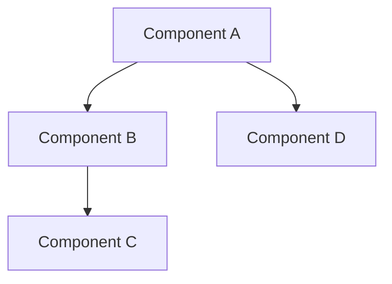
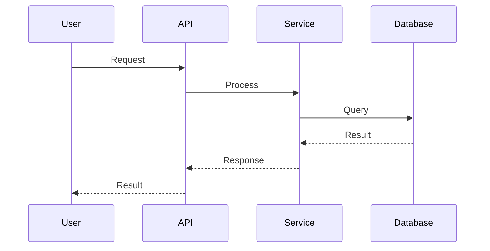

# Architecture Design

## System Overview
[Brief description of the system architecture]

## Component Diagram (Mermaid)

## Data Flow

## API Boundaries
| Endpoint | Method | Description |
|----------|--------|-------------|
| /api/v1/resource | GET | List resources |
| /api/v1/resource | POST | Create resource |

## Technology Choices
- [Language/Framework]: [Reason]
- [Database]: [Reason]
- [Infrastructure]: [Reason]
